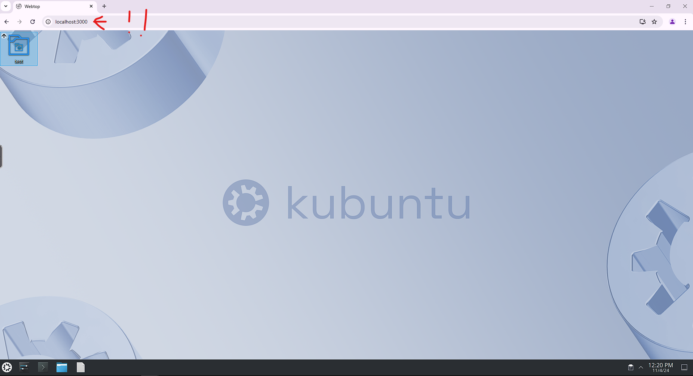
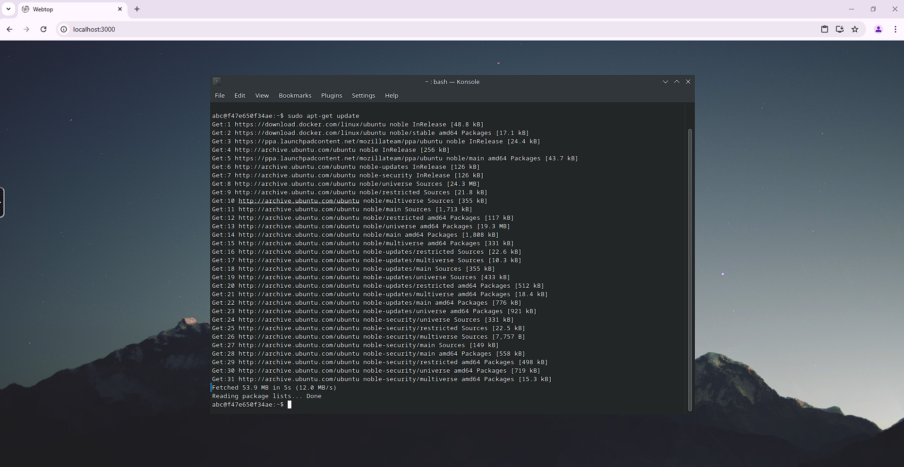
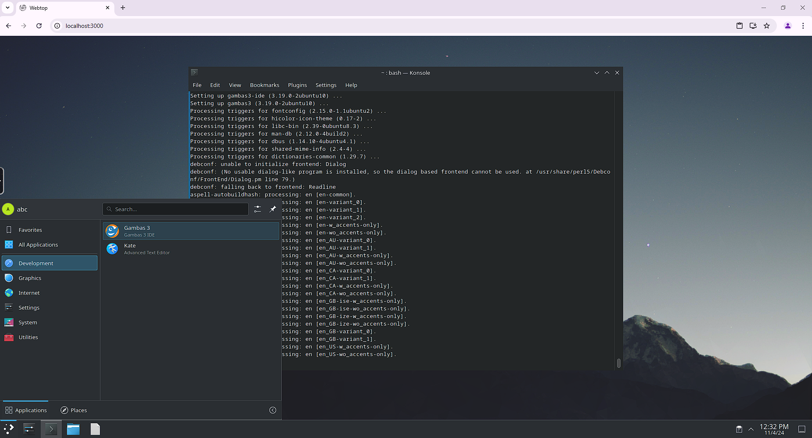
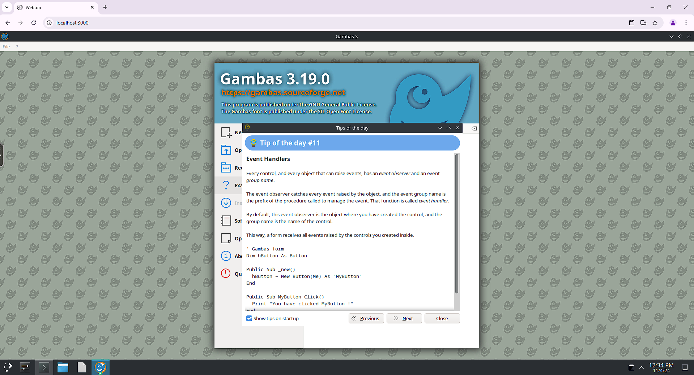
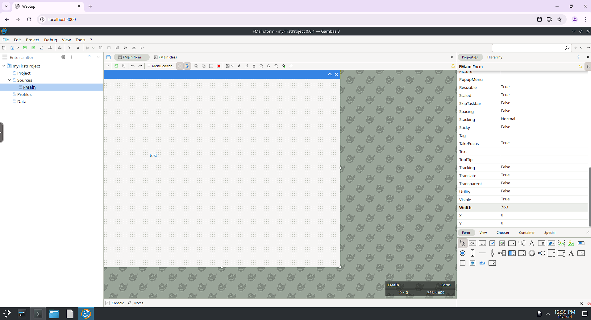

# Running gambas3 IDE on Ubuntu KDE via Docker Container

## Installing Ubuntu KDE Using Webtop in Docker

This guide provides step-by-step instructions for setting up an Ubuntu KDE environment using Webtop in a Docker container and install gambas3. Follow the steps below to get started.

## Prerequisites

Before you begin, make sure you have the following:

- A compatible version of **Docker Desktop** installed on your Windows machine. You can download it from the [Docker official website](https://www.docker.com/products/docker-desktop).

## Step 1: Install Docker on Windows

1. **Download Docker Desktop**: Visit the [Docker Desktop download page](https://www.docker.com/products/docker-desktop) and download the installer for Windows.

2. **Install Docker Desktop**:
   - Run the downloaded `.exe` file.
   - Follow the installation wizard, and ensure to enable any necessary components (such as WSL 2).
   - Once installed, launch Docker Desktop.

3. **Verify Installation**:
   - Open a terminal or command prompt.
   - Run the following command to check if Docker is installed correctly:
     ```bash
     docker --version
     ```
   - You should see the Docker version information displayed.

## Step 2: Create a Docker Compose File

1. **Create a new directory** for your Docker setup:
   ```cmd
   mkdir gambas3 && cd gambas3
2. **Create a new file docker-compose.yml** and copy the following code inside:

  ```
    version: '3.8'

    services:
      webtop:
        image: lscr.io/linuxserver/webtop:ubuntu-kde
        container_name: gambas3
        security_opt:
          - seccomp:unconfined # optional
        environment:
          - PUID=1000
          - PGID=1000
          - TZ=Etc/UTC
          - SUBFOLDER=/ # optional
          - TITLE=Webtop # optional
        volumes:
          - /path/to/data:/config
          - /:/omv-rootfs # serve for root user
          - /var/run/docker.sock:/var/run/docker.sock # optional
        ports:
          - 3000:3000
          - 3001:3001
        devices:
          - /dev/dri:/dev/dri # optional
        shm_size: "10gb" # optional
        restart: unless-stopped
  ```
3. **Open the terminal** in the directory where your docker-compose.yml file is located and run the command:
  ```
    docker-compose up -d
  ```


4. **Open Docker-Desktop** to check if the container is running


## Step 3: Open the browser

1. **Navigate to url** http://localhost:3000


2. **Open the terminal** and execute the following commands:

  ```
    sudo apt-get update
  ```
    and

  ```
    sudo apt-get install gambas3
  ```


3. **Open GambasIDE** from the applications menu:



4. **Have fun!**



